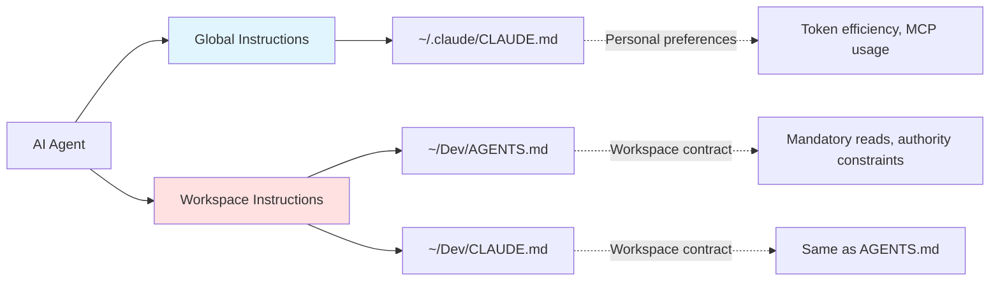
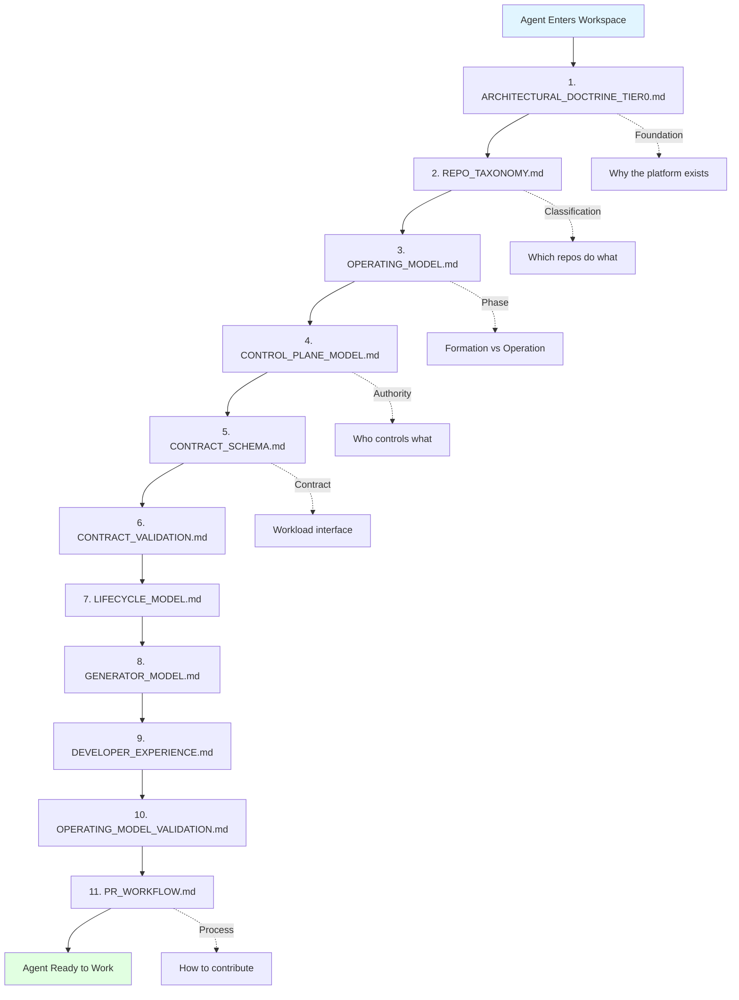
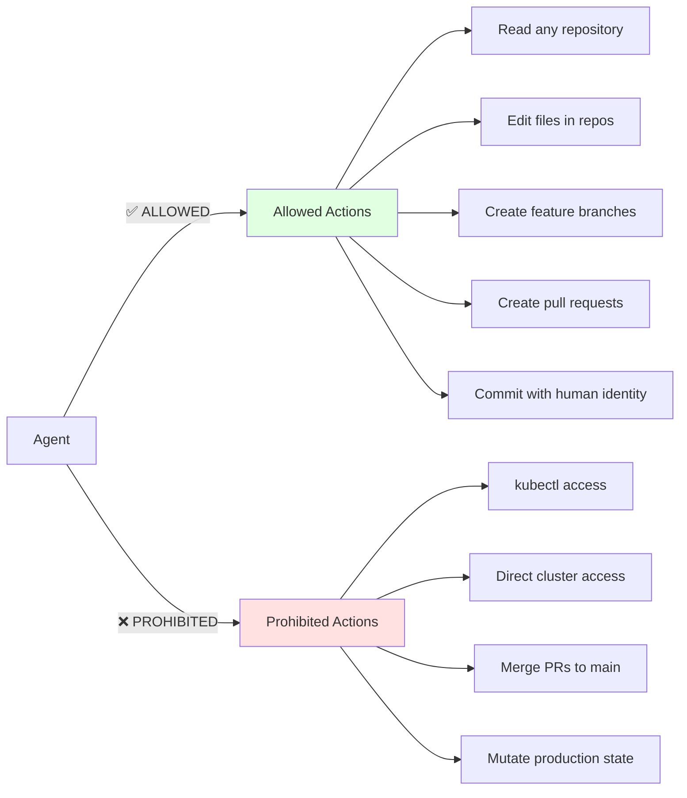
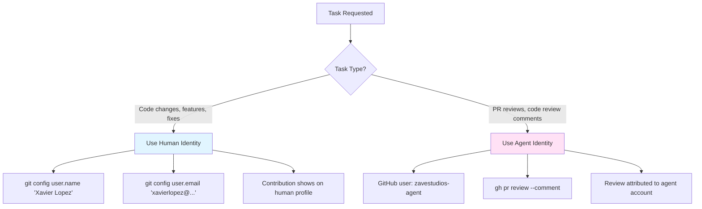
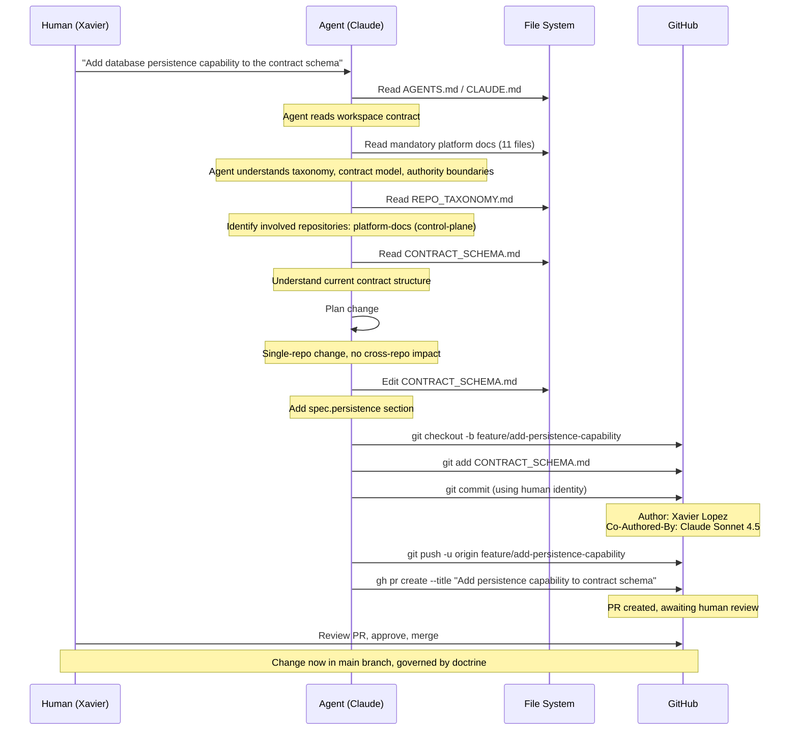
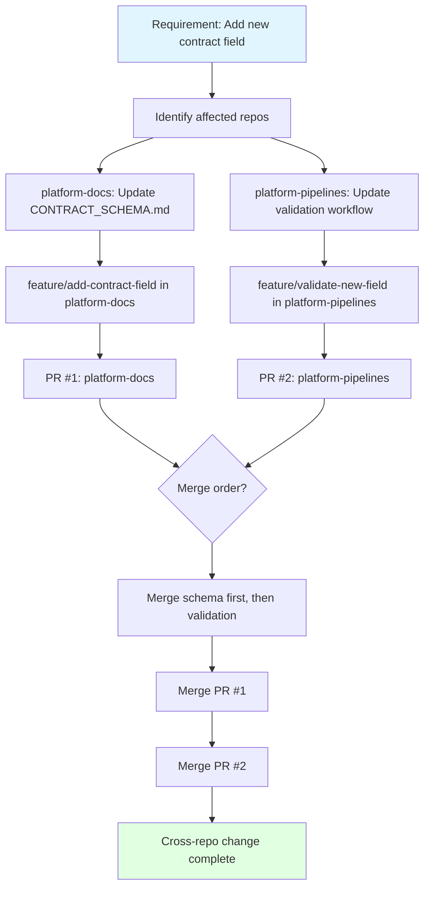

# How I Work With Agents in ZaveStudios

## Introduction

This document describes how I collaborate with AI agents (primarily Claude Code) to build and maintain the ZaveStudios platform. It's a narrative account of the systems, structures, and conventions that make human-agent collaboration productive in a multi-repository, contract-governed platform environment.

Unlike the other platform documents which define **what the platform is**, this document describes **how I work with agents to build it**.

---

## The Core Philosophy

Working with AI agents in ZaveStudios is an exercise in **controlled delegation**.

I've designed the platform to have clear boundaries, explicit contracts, and machine-readable governance. These same principles make it possible for agents to operate safely and effectively:

- Agents can read authoritative doctrine and understand the system
- Agents can propose changes through pull requests
- Agents cannot directly mutate production state
- Agents work within the same constraints as human developers

The platform's architecture wasn't designed *for* agents, but its rigor makes it **agent-friendly by default**.

---

## The Workspace Structure

### Physical Layout

I work from a single VS Code workspace that mirrors the platform's repository taxonomy. The workspace file lives at:

```
~/Dev/zavestudios.code-workspace
```

This workspace contains **every** repository in the ZaveStudios organization, organized by category:

```mermaid
graph TD
    workspace[zavestudios.code-workspace]

    workspace --> control[Control Plane]
    workspace --> infra[Infrastructure]
    workspace --> platform[Platform Services]
    workspace --> tenant[Tenant Workloads]
    workspace --> portfolio[Portfolio Sites]

    control --> platform-docs

    infra --> k8s[kubernetes-platform-infrastructure]
    infra --> gitops
    infra --> ansible
    infra --> bigbang

    platform --> pipelines[platform-pipelines]
    platform --> images[image-factory]
    platform --> pg

    tenant --> panchito
    tenant --> rigoberta
    tenant --> thehouseguy
    tenant --> mia
    tenant --> oracle
    tenant --> data-pipelines[data-pipelines]

    portfolio --> xavierlopez[xavierlopez.me]
    portfolio --> zavestudios-public[zavestudios]
    portfolio --> professional[professional-identity]

    style control fill:#e1f5ff
    style infra fill:#fff4e1
    style platform fill:#ffe1f5
    style tenant fill:#e1ffe1
    style portfolio fill:#f5e1ff
```



Each folder in the workspace is named with a category prefix:

- `control-plane` → platform-docs
- `infra-kubernetes` → kubernetes-platform-infrastructure
- `infra-gitops` → gitops
- `platform-service-ci` → platform-pipelines
- `tenant-panchito` → panchito
- `portfolio-xavierlopez` → xavierlopez.me

This naming convention serves two purposes:

1. **Human navigation** — I can instantly identify repository category
2. **Agent context** — Agents see the taxonomy structure in file paths

---

## Agent Instructions: The Two-Layer System

I use a two-layer instruction system to configure how agents work in my environment:



### Layer 1: Global Instructions (`~/.claude/CLAUDE.md`)

**Location:** `~/.claude/CLAUDE.md`

**Purpose:** Personal preferences that apply to **all** projects, not just ZaveStudios.

**Content:** Token efficiency guidance

This file encodes my preference for **CLI tools over MCP servers**:

- Use `gh` CLI instead of GitHub MCP
- Use `aws` CLI instead of AWS MCP
- Use `docker` CLI instead of Docker MCP
- Only use MCP when CLI tools don't provide the functionality

**Reasoning:**

CLI tools are more token-efficient because:
- They don't add persistent tool definitions to context
- They support targeted output via flags (`--json`, `--jq`)
- They're ephemeral — only active when invoked

MCP servers, by contrast, add tool schemas to every request. For a platform with hundreds of interactions per session, this adds up.

Context7 MCP is used selectively:
- Only for new, niche, or rapidly-evolving libraries
- Only when version-specific documentation is critical
- Not for Python stdlib or well-established libraries (10-15k token cost doesn't justify it)

### Layer 2: Workspace Instructions (`~/Dev/AGENTS.md` and `~/Dev/CLAUDE.md`)

**Location:**
- `~/Dev/AGENTS.md` (intended for any agent)
- `~/Dev/CLAUDE.md` (Claude Code-specific, same content)

**Purpose:** Define the **Workspace Agent Contract** — how agents operate within ZaveStudios specifically.

**Content:** Authority constraints and mandatory context

The workspace contract specifies:

1. **Mandatory reads** — 11 platform documents agents must read before acting
2. **Authority constraints** — What agents can and cannot do
3. **Identity rules** — When to use human vs machine identity
4. **Workflow rules** — How to handle single-repo vs cross-repo changes

**Reasoning:**

The workspace root is where I want agents to "enter" the ZaveStudios world. When an agent first encounters this workspace, it reads the contract and understands:

- This is a governed platform with explicit doctrine
- Changes must follow taxonomy and lifecycle rules
- Cluster access is prohibited
- Pull requests are the only change mechanism

I maintain both `AGENTS.md` and `CLAUDE.md` for compatibility:
- `AGENTS.md` — Generic, works with any agent tool
- `CLAUDE.md` — Specific to Claude Code (which looks for this file by convention)

They contain identical content. This redundancy ensures agents always find the contract.

---

## The Mandatory Reads

The workspace contract requires agents to read 11 platform documents **in order**:



**Why this ordering matters:**

1. **Foundation first** — Doctrine establishes why the platform exists and what it refuses to allow
2. **Classification second** — Taxonomy defines which repositories serve which purposes
3. **Mechanics third** — Operating model, control plane, and contracts define how the system works
4. **Process last** — Workflow rules define how to contribute changes

This sequence builds from **principles** → **structure** → **mechanics** → **process**.

By the time an agent reaches PR_WORKFLOW.md, it has full context for why branches are mandatory, why main is protected, and why manual `kubectl` is prohibited.

**In Practice:**

Claude Code automatically reads these documents when I reference them or when it needs to understand repository context. The contract ensures it reads them in the correct order, building understanding progressively.

---

## Authority Constraints: What Agents Cannot Do

The workspace contract explicitly prohibits certain actions:



**Rationale:**

These constraints align with the platform's control plane model:

- **GitOps is state authority** — kubectl bypasses Git, creating drift
- **Pull requests are review gates** — direct merges bypass human approval
- **Production changes require human sign-off** — agents propose, humans approve

This creates a **safe collaboration boundary**:
- Agents can do research, write code, propose changes
- Humans maintain authority over production mutations

When an agent encounters a task requiring `kubectl`, it must label those steps:

```
**Run manually by human:**
```

This makes it explicit that I need to execute that step myself.

---

## Identity and Attribution: The Two-Identity Model

The workspace contract defines **two identities** for agent work:



### Default Identity: Human (Xavier Lopez)

**When:** Writing code, creating commits, pushing branches, opening PRs

**Why:**

I want contribution attribution on **my GitHub profile**, not a bot account. When I collaborate with an agent to write a feature, the commit history should show:

```
Author: Xavier Lopez <xavierlopez@...>

🤖 Generated with Claude Code
Co-Authored-By: Claude Sonnet 4.5 <noreply@anthropic.com>
```

The co-authorship footer acknowledges agent involvement, but the primary author is me.

This keeps my contribution graph accurate and maintains the narrative that **I built this platform** (with agent assistance).

### Agent Identity: @zavestudios-agent

**When:** Code reviews, PR review comments, certain automation tasks

**Why:**

For activities where the agent acts **as a reviewer** rather than a contributor, I use the `@zavestudios-agent` GitHub user.

**@zavestudios-agent details:**

- **Type:** GitHub User account (not a GitHub App or bot token)
- **Created:** 2026-03-03
- **Organization role:** Member of `zavestudios` org
- **Team membership:** `platform-governance-reviewers`
- **Permissions:** Can review PRs on all repos via team access

**Workflow example:**

When I ask an agent to review a pull request for governance compliance:

```bash
# Agent uses zavestudios-agent identity
gh pr review 123 \
  --comment \
  --body "Governance check: This PR modifies CONTRACT_SCHEMA.md..."
```

This creates a review comment attributed to `@zavestudios-agent`, making it clear that this is agent-generated feedback, not human review.

**Why a user account, not a bot?**

GitHub Apps have more granular permissions but require infrastructure (webhook endpoints, key management). A user account with team-based permissions is simpler:

- No infrastructure to maintain
- Team membership grants scoped access
- Standard git/gh CLI authentication

**The `platform-governance-reviewers` team:**

This team includes:
- `eckslopez` (my personal account)
- `zavestudios-agent` (the agent account)

Team members can review PRs on `platform-docs` and enforce governance rules. The agent account participates in this team as a "peer reviewer" for contract integrity checks.

---

## The Agent Workflow: From Request to Pull Request

Here's how a typical agent collaboration session flows:



**Key steps:**

1. **Context Loading** — Agent reads workspace contract and platform docs
2. **Repository Classification** — Agent identifies which repos are affected (using REPO_TAXONOMY)
3. **Change Scoping** — Agent determines if change is single-repo or cross-repo
4. **Branch Creation** — Agent creates feature branch (never commits to main)
5. **Human Identity** — Agent commits using my git identity
6. **Pull Request** — Agent opens PR with description and context
7. **Human Gate** — I review and approve before merge

This workflow ensures:
- Agents have full context before acting
- Changes follow taxonomy and lifecycle rules
- Human review is mandatory before production impact
- Contribution attribution goes to me (human)

---

## Cross-Repo Changes: The Coordination Challenge

Single-repo changes are straightforward. Cross-repo changes require coordination.

**Example scenario:** Update contract schema and modify validation logic in platform-pipelines to support it.



**Agent responsibilities for cross-repo changes:**

1. **Identify all affected repositories** (using REPO_TAXONOMY)
2. **Create separate feature branches** in each repo
3. **Create separate pull requests** for each repo
4. **Document the dependency relationship** in PR descriptions
5. **Call out merge order** if sequencing matters

**Human responsibilities:**

- Review all PRs together (treating them as an atomic changeset)
- Merge in correct order
- Verify cross-repo consistency

**Why not a monorepo?**

The multi-repo structure reflects the platform's **separation of concerns**:
- Control plane defines doctrine
- Platform services provide capabilities
- Tenant repos are workload-specific

A monorepo would collapse these boundaries. The taxonomy structure preserves them, at the cost of cross-repo coordination overhead.

Agents make this overhead manageable by automating branch creation, PR generation, and dependency documentation.

---

## MCP Servers: Use Sparingly

The workspace contract (via global `CLAUDE.md`) instructs agents to **prefer CLI tools over MCP servers**.

**Why this preference?**

MCP servers add persistent tool definitions to every agent request. For a typical session:

- GitHub MCP: ~50 tool definitions
- AWS MCP: ~200 tool definitions
- Docker MCP: ~30 tool definitions

Each tool definition consumes context tokens. Over a long session with hundreds of interactions, this compounds.

**CLI tools are ephemeral:**

```bash
# CLI invocation (no persistent context cost)
gh pr list --json number,title,url --jq '.[] | select(.title | contains("contract"))'
```

This runs, returns results, and disappears. No persistent tool definitions.

**When MCP is appropriate:**

1. **Browser automation** — Browser MCP for web interactions (no CLI alternative)
2. **Complex stateful operations** — When CLI tools require excessive chaining
3. **Explicit user request** — When I specifically ask for MCP usage

**Context7 MCP (library documentation):**

I use Context7 MCP selectively for library docs:

- ✅ New libraries (e.g., Anthropic SDK updates released after training cutoff)
- ✅ Version-specific API changes (e.g., "What changed in Next.js 15?")
- ❌ Python stdlib (well-covered in training data)
- ❌ Simple questions (10-15k token cost not justified)

**In practice:**

Most GitHub operations use `gh` CLI:

```bash
# List PRs
gh pr list --json number,title,author,url

# Create PR
gh pr create --title "..." --body "..."

# Review PR
gh pr review 123 --approve

# Merge PR
gh pr merge 123 --squash
```

Only when `gh` CLI doesn't support an operation (e.g., managing GitHub Actions secrets, complex review threading) would we fall back to GitHub MCP.

---

## The Agent's Perspective: What It Sees

When an agent (Claude Code) works in my ZaveStudios workspace, here's what it experiences:

### On First Entry

1. **Workspace detection** — Sees `zavestudios.code-workspace` and multi-repo structure
2. **Contract discovery** — Finds `AGENTS.md` and `CLAUDE.md` at workspace root
3. **Mandatory reads** — Reads 11 platform documents in sequence
4. **Context building** — Understands taxonomy, contracts, authority boundaries

### During a Task

1. **Repository classification** — Uses REPO_TAXONOMY to identify affected repos
2. **Contract validation** — Checks if changes align with CONTRACT_SCHEMA
3. **Authority check** — Confirms no kubectl or cluster access required
4. **Identity selection** — Uses human identity for commits, agent identity for reviews (if requested)

### When Uncertain

1. **Document reference** — Agent cites specific docs (e.g., "Per ARCHITECTURAL_DOCTRINE_TIER0.md...")
2. **Manual step callout** — Labels kubectl steps as "Run manually by human"
3. **Cross-repo dependency warning** — Explicitly documents repo coordination needs

### The Result

The agent operates as a **governed collaborator** rather than an autonomous actor. It has broad capabilities (read, write, branch, PR) but narrow authority (no merge, no production mutation).

This matches the platform's design philosophy: **bounded autonomy within explicit constraints**.

---

## Practical Examples

### Example 1: Adding a New Contract Field

**Request:** "Add a `spec.resources.tier` field to the contract schema"

**Agent workflow:**

1. Read `AGENTS.md` → load workspace contract
2. Read mandatory platform docs (focusing on CONTRACT_SCHEMA.md)
3. Identify affected repo: `platform-docs` (control-plane category)
4. Determine change scope: single-repo
5. Create branch: `feature/add-resources-tier-field`
6. Edit `CONTRACT_SCHEMA.md`:
   - Add new section documenting `spec.resources.tier`
   - Add allowed values (small, standard, large)
   - Update full example
7. Commit with human identity (Xavier Lopez)
8. Push branch
9. Create PR with description explaining rationale
10. Wait for human review

**Manual steps required:** None (agent can complete end-to-end)

**Attribution:** Commit attributed to Xavier Lopez with Claude co-authorship footer

---

### Example 2: Reviewing a Governance PR

**Request:** "Review PR #45 in platform-docs for governance compliance"

**Agent workflow:**

1. Read workspace contract
2. Switch to agent identity (`@zavestudios-agent`)
3. Fetch PR: `gh pr view 45 --json files,title,body`
4. Read modified files
5. Cross-reference against ARCHITECTURAL_DOCTRINE_TIER0.md
6. Check for contract schema violations
7. Verify taxonomy consistency
8. Post review comment:
   ```bash
   gh pr review 45 --comment --body "Governance review:\n- ✅ No contract breaking changes\n- ✅ Taxonomy alignment preserved\n- ⚠️  Consider updating OPERATING_MODEL_VALIDATION.md..."
   ```

**Manual steps required:** None (automated review)

**Attribution:** Review comment attributed to `@zavestudios-agent`

---

### Example 3: Cross-Repo Feature Addition

**Request:** "Add Redis persistence support to the platform"

**Agent workflow:**

1. Read workspace contract and mandatory docs
2. Identify affected repos (using REPO_TAXONOMY):
   - `platform-docs` (update CONTRACT_SCHEMA.md)
   - `platform-pipelines` (update validation workflow)
   - `pg` (add redis provisioning module)
3. Determine merge order:
   - Schema first (defines interface)
   - Validation second (enforces schema)
   - Provisioning third (implements capability)
4. Create feature branches in each repo:
   - `platform-docs`: `feature/add-redis-persistence`
   - `platform-pipelines`: `feature/validate-redis-persistence`
   - `pg`: `feature/provision-redis`
5. Commit changes (using human identity)
6. Create 3 separate PRs with cross-references
7. Document merge sequence in each PR description

**Manual steps required:**
- Review all 3 PRs
- Merge in documented order
- Verify cross-repo consistency

**Attribution:** All commits attributed to Xavier Lopez

---

## What Makes This Work

### Explicitness Over Convention

The platform documents everything:
- Repository categories (REPO_TAXONOMY.md)
- Contract schema (CONTRACT_SCHEMA.md)
- Authority boundaries (CONTROL_PLANE_MODEL.md)
- Workflow rules (PR_WORKFLOW.md)

Agents can read these and understand the system. There's no hidden tribal knowledge.

### Machine-Readable Governance

The workspace contract is structured instruction:
- Ordered mandatory reads
- Explicit prohibitions
- Identity rules

Agents don't need to infer — they follow the contract.

### Pull Requests as Review Gates

All changes go through PRs. This creates a **human approval checkpoint** before production impact.

Agents can propose, but humans decide.

### Identity Separation

Using two identities (human for commits, agent for reviews) maintains:
- Accurate contribution attribution
- Clear signal about who did what
- Flexibility in collaboration modes

### Taxonomy-Driven Navigation

The workspace structure mirrors the taxonomy. Agents (and humans) can navigate by category:

- Need to update contracts? → `control-plane/platform-docs`
- Need to change CI? → `platform-service-ci/platform-pipelines`
- Need to modify a tenant? → `tenant-*/` folders

### Token Efficiency Discipline

Preferring CLI tools over MCP servers keeps context budgets manageable. Over hundreds of interactions, this matters.

---

## Limitations and Trade-offs

### What This Model Doesn't Handle Well

**1. Break-glass scenarios**

If production is on fire and I need immediate `kubectl` intervention, agents can't help. The workspace contract prohibits direct cluster access.

**Trade-off accepted:** Production safety > agent autonomy.

**2. Complex multi-stage cross-repo changes**

When a feature requires coordinated updates across 5+ repos with intricate sequencing, the coordination overhead becomes significant.

**Trade-off accepted:** Repository separation preserves architectural boundaries. Coordination complexity is the cost.

**3. External system integration**

Agents work within the ZaveStudios repos. They can't directly interact with external systems (AWS console, Kubernetes dashboard, monitoring tools) unless mediated through CLI tools or APIs.

**Trade-off accepted:** This maintains the GitOps control plane model.

### What Could Be Improved

**Agent identity management:**

Currently, `@zavestudios-agent` uses my personal access token. A proper GitHub App would be more robust but requires infrastructure.

**Future evolution:** Migrate to GitHub App with scoped permissions and webhook-based workflows.

**MCP server optimization:**

Even with CLI preference, some MCP usage is unavoidable. Future work could involve:
- Caching MCP tool definitions
- Lazy-loading MCP servers
- Custom lightweight MCP servers for ZaveStudios-specific operations

**Cross-repo coordination automation:**

The manual merge sequencing for cross-repo changes could be automated with:
- Dependency declarations in PRs (machine-readable)
- Automated merge ordering based on dependency graph
- CI checks that verify cross-repo consistency

---

## Conclusion

Working with agents in ZaveStudios is about **amplifying human capability within governed boundaries**.

The platform's architectural rigor (doctrine, taxonomy, contracts) creates a structured environment where agents can:
- Understand the system by reading authoritative documents
- Propose changes through pull requests
- Follow consistent workflows
- Operate safely without direct production access

The two-layer instruction system (global preferences + workspace contract) ensures agents have the right context and constraints.

The two-identity model (human for commits, agent for reviews) maintains accurate attribution while enabling flexible collaboration.

The result is a collaboration model where:
- I maintain strategic authority (reviews, merges, production decisions)
- Agents handle tactical execution (research, code writing, PR creation)
- The platform's governance enforces safety automatically

This isn't "AI replaces the platform engineer."

This is "AI becomes a governed collaborator within the platform's control plane model."

And that's exactly what makes it work.

---

## Related Documentation

- ARCHITECTURAL_DOCTRINE_TIER0.md — Foundation principles that govern agent behavior
- REPO_TAXONOMY.md — Repository classification agents use for navigation
- CONTROL_PLANE_MODEL.md — Authority boundaries agents must respect
- PR_WORKFLOW.md — Process agents follow for contributing changes
