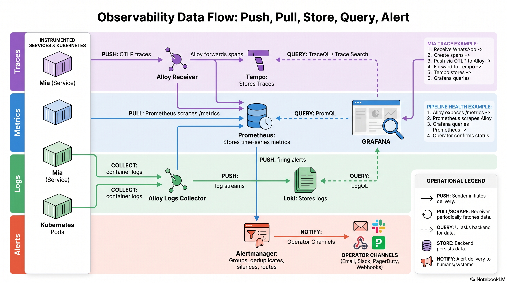

# Observability Data Flow

## Purpose

This note explains the runtime shape of the platform observability stack:
which systems push telemetry, which systems pull or scrape metrics, where
signals are stored, and how operators query them.

For capability ownership and completion rules, read
[`../OBSERVABILITY_MODEL.md`](../OBSERVABILITY_MODEL.md).

## Diagram



## Core Model

The platform has separate paths for traces, metrics, logs, and alerts. They
share the Grafana operator surface, but they do not all flow through the same
backend.

### Traces

Instrumented services push trace spans using OTLP.

```text
instrumented service -> OTLP -> Alloy receiver -> Tempo -> Grafana
```

In a concrete workload example:

```text
instrumented workload -> OTLP -> Alloy receiver -> Tempo -> Grafana
```

The workload emits spans, Alloy receives and forwards them, Tempo stores them,
and Grafana queries Tempo with TraceQL or trace search.

Prometheus is not in the trace ingestion path.

### Metrics

Prometheus pulls metrics by scraping `/metrics` endpoints.

```text
service or pipeline component /metrics -> Prometheus -> Grafana
```

Prometheus stores time-series metrics and Grafana queries Prometheus with
PromQL. This path is used for workload metrics and for observing the health of
pipeline components such as Alloy, Tempo, Loki, Grafana, and Kubernetes
components.

### Logs

Workloads write logs through the Kubernetes/container logging path. A collector
tails or collects those logs and forwards them to Loki.

```text
Kubernetes pods -> log collector -> Loki -> Grafana
```

Loki stores indexed log streams and Grafana queries Loki with LogQL.

### Alerts

Prometheus evaluates alert rules against metrics. When rules fire, Prometheus
sends alerts to Alertmanager.

```text
Prometheus -> Alertmanager -> operator notification channels
```

Alertmanager groups, deduplicates, silences, and routes alerts to configured
notification channels such as email, Slack, webhooks, or paging systems.

## Operator Examples

### Request Investigation Workflow

The canonical operator path starts from a user-visible request or symptom and
uses Grafana as the primary interface:

1. Find workload logs in Loki for the affected namespace, workload, and time
   window.
2. Check Prometheus metrics and target health for the workload and the
   relevant collector/backend components.
3. Inspect a Tempo trace for the same request class when tracing is enabled.
4. Check Grafana or Alertmanager alert visibility for related firing alerts or
   notification state.

Direct cluster shell access is a fallback diagnostic path, not the standard
operator workflow.

### Historical Mia v1 Trace Example

Mia v1 is retired. This example remains as historical validation evidence for
the tracing path; it is not the current reference workload.

1. Mia v1 receives a WhatsApp message.
2. Mia v1 creates trace spans.
3. Mia v1 pushes spans over OTLP to Alloy.
4. Alloy forwards spans to Tempo.
5. Tempo stores the trace.
6. Grafana queries Tempo so an operator can inspect the request.

### Pipeline Health Example

1. Alloy exposes its own `/metrics` endpoint.
2. Prometheus scrapes Alloy.
3. Grafana queries Prometheus.
4. An operator confirms whether Alloy is up, receiving spans, exporting spans,
   or dropping data.

## Current Platform Notes

The retired Mia v1 trace path was verified end to end:

```text
WhatsApp user action -> Mia v1/OpenClaw -> OTEL/OTLP -> Alloy receiver -> Tempo -> Grafana
```

The retired Mia v1 log discovery path was also verified from Grafana:

```text
WhatsApp user action -> Mia v1/OpenClaw logs -> Loki -> Grafana
```

Prometheus visibility for the core observability stack has been verified.
Prometheus scrape coverage for `alloy-receiver` is tracked separately in
`zavestudios/gitops#343`.

Alertmanager and Grafana alerting UI visibility have been verified. Intentional
operator contact points and notification policy routing are also tracked in
`zavestudios/gitops#343`.

## Terminology

- **Push**: the sender initiates delivery of telemetry.
- **Pull / scrape**: the receiver periodically fetches metrics from an exposed
  endpoint.
- **Forward**: a collector receives telemetry and sends it to a backend.
- **Store**: a backend persists telemetry for later query.
- **Query**: Grafana asks a backend for stored telemetry.
- **Notify**: Alertmanager delivers alerts to humans or downstream systems.
